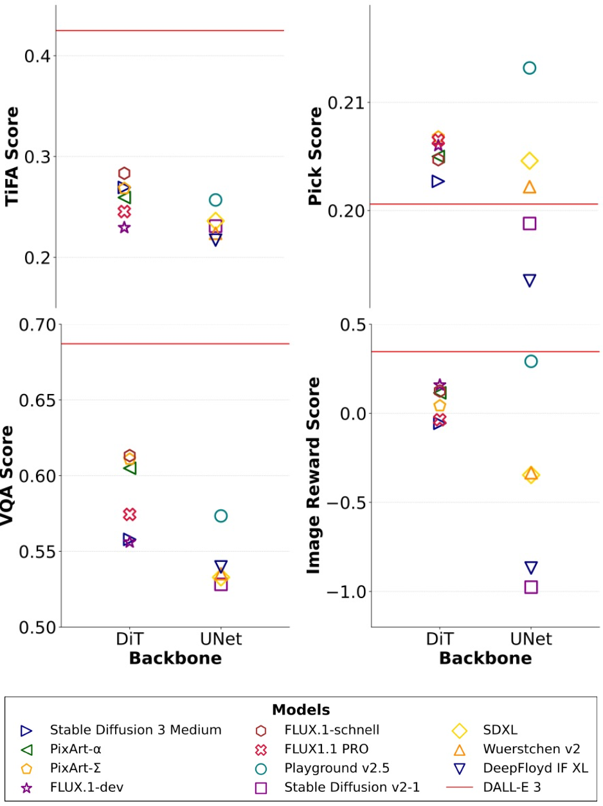
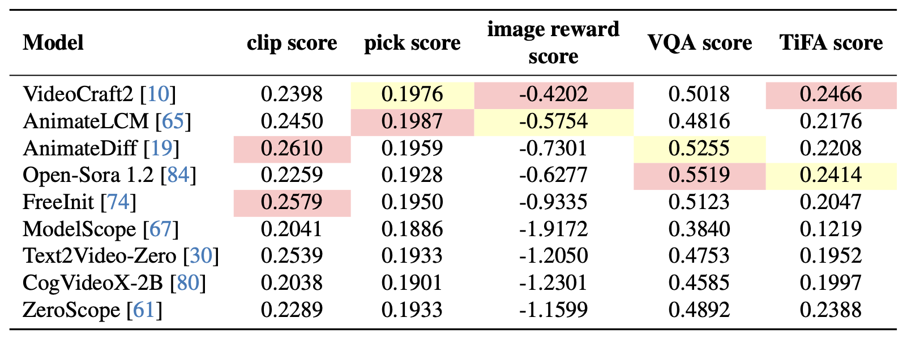
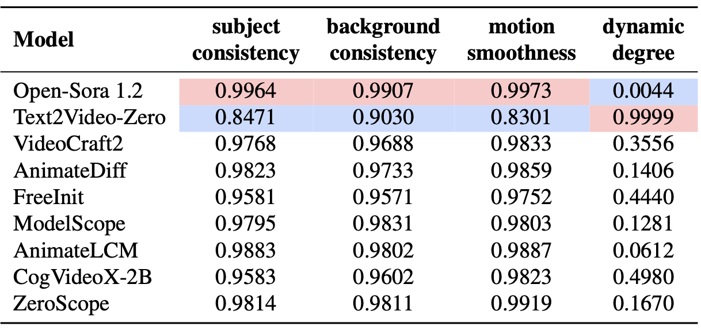
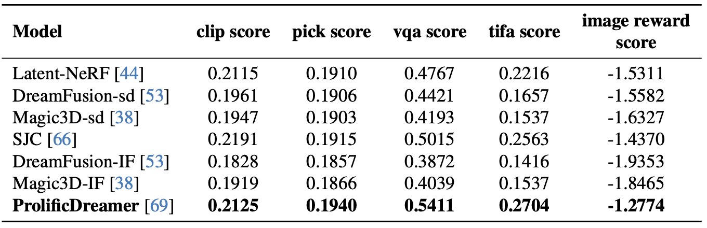
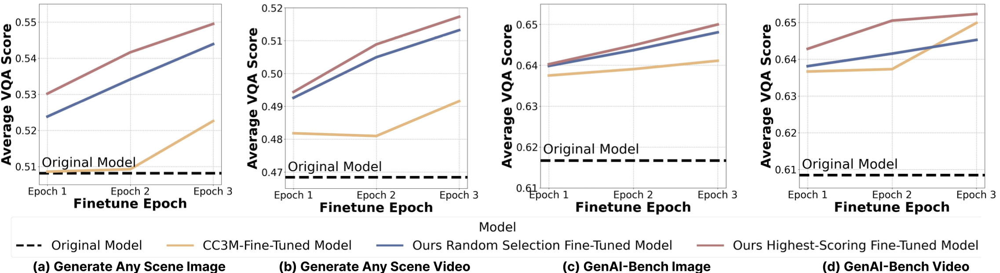
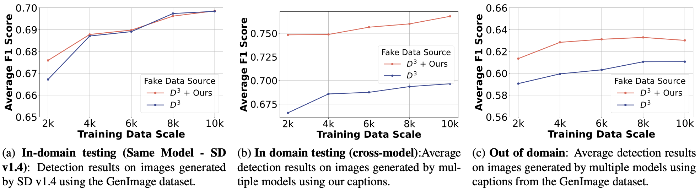

<h1 align="center"> Generate Any Scene: Scene Graph Driven Data Synthesis for Visual Generation Training</h2>


<h2 align="center"> <a href="https://generate-any-scene.github.io/">🌐 Website</a> | <a href="https://arxiv.org/abs/2412.08221">📑 Paper</a> | <a href="https://huggingface.co/datasets/UWGZQ/GenerateAnyScene">🤗 Caption Dataset</a>


**Generate Any Scene** is a framework designed to systematically evaluate and improve text-to-vision models by generating a vast array of synthetic captions derived from dynamically constructed scene graphs. These scene graphs can represent almost any kind of scene, from realistic to imaginative compositions.

<!-- --- -->

<!-- **Ziqi Gao<sup>*</sup><sup>1</sup>, Weikai Huang<sup>*</sup><sup>1</sup>, Jieyu Zhang<sup>1</sup>, Aniruddha Kembhavi<sup>2</sup>, Ranjay Krishna<sup>1,2</sup>**

<sup>1</sup>University of Washington  
<sup>2</sup>Allen Institute for AI  
<sup>*</sup>Equal Contribution -->
<!-- --- -->


## Installation
Follow the steps below to set up the environment and use the repository:

```bash
# Clone the repository
git clone https://github.com/RAIVNLab/GenerateAnyScene.git
cd ./GenerateAnyScene
git submodule update --init --recursive

# Create and activate a Python virtual environment:
conda create -n GenerateAnyScene python==3.10.14
conda activate GenerateAnyScene

# Install the required dependencies:
pip install -r requirements.txt
pip install transformers==4.47.1 --force-reinstall --no-warn-conflicts
```
For the OpenSora 1.2 model, please refer to the [installation instructions](https://github.com/hpcaitech/Open-Sora#installation) provided in its official repository.

For text-to-3D generation, please follow the [setup guide](https://github.com/threestudio-project/threestudio/blob/main/docs/installation.md) from the ThreeStudio repository.

#### Note
If you prefer using pre-configured environments, we provide Docker images for both Text-to-Video and Text-to-3D tasks. To download the Docker containers:
```bash
docker pull uwziqigao/3d-gen:latest
docker pull uwziqigao/video_gen:latest
```

## Captions Generation
After downloading and setting up the repo, you can generate captions using the following command:
```bash
python generation.py \
  --metadata_path ./metadata \
  --output_dir ./output \
  --total_prompts 1000 \
  --num_workers 1 \  # enable parallelism by setting num_workers > 1
  --min_complexity 4 \
  --max_complexity 7 \
  --min_attributes 1 \
  --max_attributes 4 \
  --modality_type text2image # or text2video or text2threed for different modalities
```

## Generation and Evaluation
We currently support a wide range of models and metrics, including:
1. **Text-to-Image Models**
- Stable Diffusion 3 Medium
- Stable Diffusion 2-1  
- SDXL
- PixArt-α  
- PixArt-Σ  
- Wuerstchen v2  
- DeepFloyd IF XL  
- FLUX.1-dev  
- FLUX.1-schnell  
- Playground v2.5  

2. **Text-to-Video Models**
- Text2Video-Zero 
- ZeroScope
- VideoCraft2  
- AnimateDiff  
- AnimateLCM  
- FreeInit  
- ModelScope  
- Open-Sora 1.2  
- CogVideoX-2B

3. **Text-to-3D Models**  
- Latent-NeRF  
- DreamFusion-sd 
- DreamFusion-IF  
- Magic3D-sd  
- Magic3D-IF  
- ProlificDreamer  
- Fantasia3D  
- SJC

4. **Metrics**
- Clip Score
- Pick Score
- Image Reward Score
- Tifa Score
- VQA Score

### Running the Demo
The `demo.py` script allows you to generate and evaluate images, videos, or 3D scenes using prompts from a JSON file. Below are the instructions for running the script:
#### **Command Syntax**
```bash
python demo.py --input_file <path_to_json_file> --gen_type <generation_type> [--models <model1> <model2> ...] [--metrics <metric1> <metric2> ...] [--output_dir <path_to_output_directory>]
```
#### **Required Arguments**
- `--input_file`: Path to the JSON file containing captions. The JSON file must include captions generated by `generation.py`.
- `--gen_type`: Type of generation you want to perform. Choose one of:
  - `image` for image generation.
  - `video` for video generation.
  - `3d` for 3D scene generation.

### **Examples**
Generate images using default models and metrics:
```bash
python demo.py --input_file output/prompts_batch_0.json --gen_type image
```
Generate images using specific models and metrics:
```bash
python demo.py --input_file output/prompts_batch_0.json --gen_type image --models stable-diffusion-2-1 --metrics ProgrammaticDSGTIFAScore
```

## What is Generate Any Scene

Generative models have shown remarkable capabilities in producing images, videos, and 3D assets from textual descriptions. However, current benchmarks predominantly focus on real-world images paired with captions. To address this limitation, we introduce **Generate Any Scene**, a novel framework that:

- Systematically enumerates **scene graphs** using a structured taxonomy of visual elements—encompassing objects, attributes, and relations—to produce almost infinite varieties of scenes.
- Leverages **Scene Graph Programming**, a method to dynamically construct scene graphs and translate them into coherent captions.
- Provides a means to scale evaluation of text-to-vision models beyond standard benchmarks, enabling evaluation on both realistic and highly imaginative scenarios.

Our evaluations on various text-to-image, text-to-video, and text-to-3D models provide key insights into model capabilities and limitations. For instance, we find that text-to-image models with DiT backbones better align with captions compared to those with UNet backbones. Text-to-video models struggle with balancing visual dynamics and consistency, while text-to-3D models show significant gaps in aligning with human preferences.

We further demonstrate the practical utility of **Generate Any Scene** with three applications:

1. **Self-Improvement Framework**: Iteratively improving a model using its own generations guided by generated captions.
2. **Distillation Process**: Transferring specific strengths from proprietary models to open-source counterparts.
3. **Content Moderation Enhancement**: Identifying and generating challenging synthetic data to improve content moderation models.

---

## Scene Graph Programming

**Metadata Types:**

| Metadata Type    | Number   | Source           |
|------------------|----------|------------------|
| Objects          | 28,787   | WordNet          |
| Attributes       | 1,494    | Wikipedia, etc.  |
| Relations        | 10,492   | Robin            |
| Scene Attributes | 2,193    | Places365, etc.  |

**Caption Generation Process:**

1. **Scene Graph Structure**: Enumerate graph structures that include nodes (objects), attributes, and relations.
2. **Populating Metadata**: Assign specific content to each node from the metadata pool.
3. **Scene Attributes**: Sample contextual details such as art style or camera settings.
4. **Caption Formation**: Combine the scene graph and scene attributes into a coherent text description.

<p align="center">
  
</p>

---

## Overall Results

### Text-to-Image

<p align="center">
  
</p>
*Comparative evaluation of text-to-image models using TiFA-Score, Pick-Score, VQA-Score, and Image-Reward-Score on 10K **Generate Any Scene** captions.*

### Text-to-Video

<p align="center">
  
</p>
*Overall performance of text-to-video models on 10K **Generate Any Scene** captions.*
  
<p align="center">
  
</p>
*Performance of text-to-video models on VBench metrics.*

### Text-to-3D

<p align="center">
  
</p>
*Performance of text-to-3D models on 10K **Generate Any Scene** captions using VBench metrics.*

---

## Applications

<p align="center">
  
</p>

### Application 1: Self-Improving

<p align="center">
  
</p>

We iteratively improve models by leveraging **Generate Any Scene** captions. Given a model's generated images, we select the best generations and fine-tune the model on them, leading to performance boosts. Stable Diffusion v1.5 gains around 5% performance improvements, outperforming even fine-tuning on real CC3M captions.

### Application 2: Distilling Limitations

<p align="center">
  
</p>

We identify and distill the specific strengths of proprietary models into open-source counterparts. For example, DALL·E 3's compositional prowess is transferred to Stable Diffusion v1.5, effectively closing the performance gap in handling complex multi-object scenes.

### Application 3: Improving Content Moderation

<p align="center">
  
</p>

By using **Generate Any Scene** to generate challenging synthetic data, we train content moderators to better detect generated imagery. This robustifies detectors across different models and datasets, improving the reliability and safety of generative AI.

---

## Metadata Structure
metadata:
* **attributes.json**: each key is a category of attributes, and the value is a list of attributes
* **objects.json**: a list of objects metadata
* **relations.json**: each key is a category of attributes, and the value is a list of attributes
* **scene_attributes.json**: a 2 level nested dictionary, where the first level is the scene attribute category, and the second level is the subcategory, and the value is a list of corresponding scene attributes.
* **taxonomy.json**: The taxonomy of objects, each edge is a directed edge from parent to child, indicates the first concept is the super concept of the second concept.


## Citation

If you find **Generate Any Scene** helpful in your work, please cite:

```bibtex
@misc{gao2024generatesceneevaluatingimproving,
      title={Generate Any Scene: Evaluating and Improving Text-to-Vision Generation with Scene Graph Programming}, 
      author={Ziqi Gao and Weikai Huang and Jieyu Zhang and Aniruddha Kembhavi and Ranjay Krishna},
      year={2024},
      eprint={2412.08221},
      archivePrefix={arXiv},
      primaryClass={cs.CV},
      url={https://arxiv.org/abs/2412.08221}, 

}
